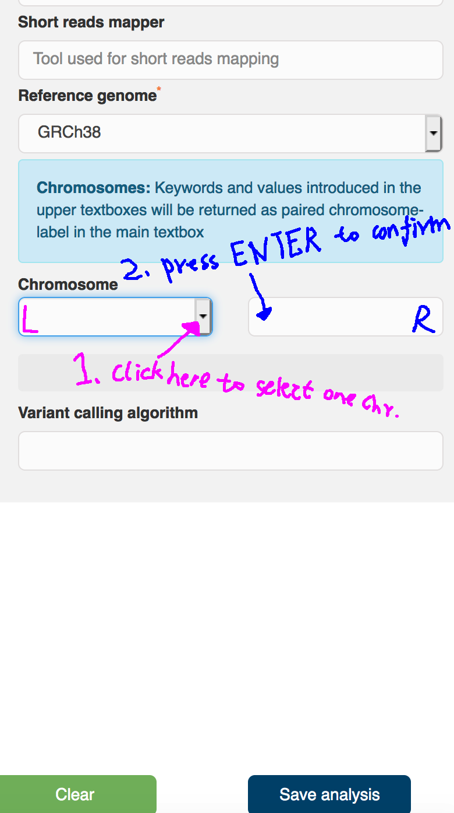

# EGA Data submission

Describe steps of data submission to EGA database (it is such a PAIN for a first time submitter), data encryption and submission codes adapted from [Salpie Nowinski](https://github.com/salpie)

## Apply EGA submission account

I wrote an email for the account request from EGA helpdesk, helpdesk@ega-archive.org. There maybe other approaches. Currently we need two files to obtain the account:

+ Data Processing Agreement (DPA), signed by the PI and institution, https://ega-archive.org/files/EGA_Data_Processing_Agreement_v1.0.pdf
+ Submitter's info, signed by the PI also, https://ega-archive.org/files/Authorised_submitters_list.docx

## Encrypting BAM files

This step can be processed prior to the account application as it may takes quite long time.

```
#!/bin/sh
#$ -cwd           # Set the working directory for the job to the current directory
#$ -j y

#$ -pe smp 4    # Request 4 core
#$ -l h_vmem=20G
#$ -N encrypt
#$ -l h_rt=20:00:00 # Request 20 hour runtime
#$ -t 1-3 ## I have 3 BAMs to be encrypted

module load java

bam_path=/path-to-your-bamfile-folder/

## the following two lines will assign bam files to 3 jobs if there are free computing resources:
samples=/path-to-your-sample.list-file/samples.list ## a configure file about file names of all BAMs you want to encrypt, one bam at one line.
sample=$(sed -n "${SGE_TASK_ID}p" $samples)

java -Xmx70G -jar /data/BCI-EvoCa2/salpie/EGA/EgaCryptor/EgaCryptor.jar -file $bam_path/$sample

```

## Sending encrypted files to EGA box
When encrypted files and account are ready, next step is to submit all files to EGA box associated to your applied account using aspera:

```
#!/bin/bash
#$ -j y
#$ -cwd 
#$ -S /bin/bash
#$ -l h_rt=70:0:0 ## yes, it could that long for WGS 
#$ -pe smp 4
#$ -l h_vmem=15G
#$ -N submission
#$ -m beas
#$ -t 1-3

module load aspera

samples=/path-to-your-sample.list-file/samples.list. ## similar configuration file telling each array jobs which files will be submitted
sample=$(sed -n "${SGE_TASK_ID}p" $samples)

path=/path-to-your-encrypted-files/

## we need to submitted all encrypted files generated from the last step; there are 3 files. 
## **** ADD YOUR PASSWORD and ACCOUNT in each line *****

ASPERA_SCP_PASS=[YOUR-PASSWORD] ascp -P33001  -O33001 -QT -l300M -L- $path/"$sample".gpg [YOUR-ACCOUNT]@fasp.ega.ebi.ac.uk:/.
ASPERA_SCP_PASS=[YOUR-vPASSWORD] ascp -P33001  -O33001 -QT -l300M -L- $path/"$sample".gpg.md5 [YOUR-ACCOUNT]@fasp.ega.ebi.ac.uk:/.
ASPERA_SCP_PASS=[YOUR-PASSWORD] ascp -P33001  -O33001 -QT -l300M -L- $path/"$sample".md5 [YOUR-ACCOUNT]@fasp.ega.ebi.ac.uk:/.

```

## Filling up metadata for the study
There are detailed videos teaching how to fill the metadata , it was really helpful https://ega-archive.org/submission/tools/submitter-portal. But two points may drive you crazy.
+ First of all, DO NOT USE Safri!!! Use other browser instead;
+ For the contact of DAC, do not add space between the telephone number;
+ To fill an analysis object to add VCF file, the 'chromosome box' shows a list containing all identifiers of the chromosomes in the genome assembly. To select one of the chr, you **HAVE TO PRESS ENTER in the blank 'box' on the right side next to "chromosome box"**, there you will have your selected chromosome shown below the 'left-box'. If your VCF file contains more, use the same way to select all of them. 

Once the whole stage filled up, you will get the accession number after you submit the registered study.

## Notify EGA team Re submission completion

Let the EGA team know you are done, so your stuff will be published online.
